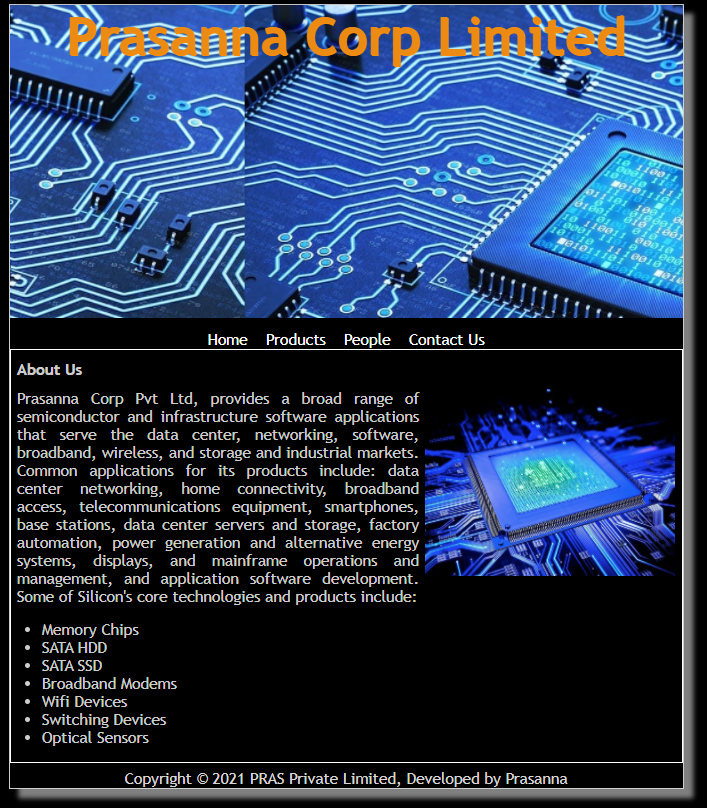
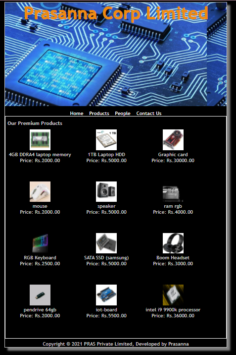
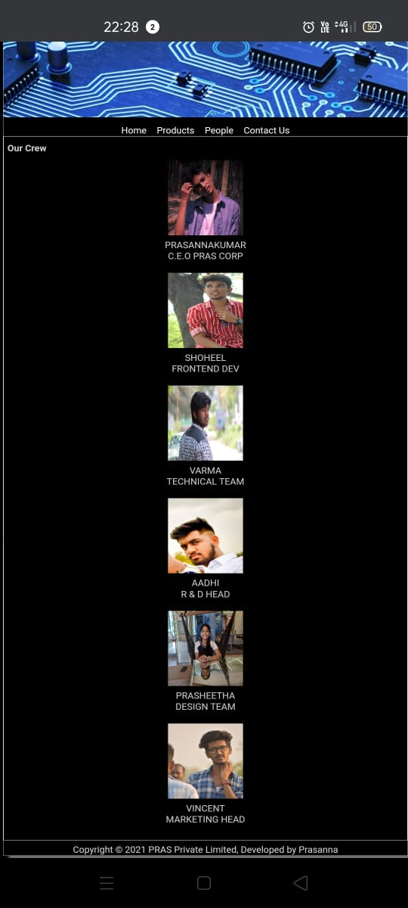
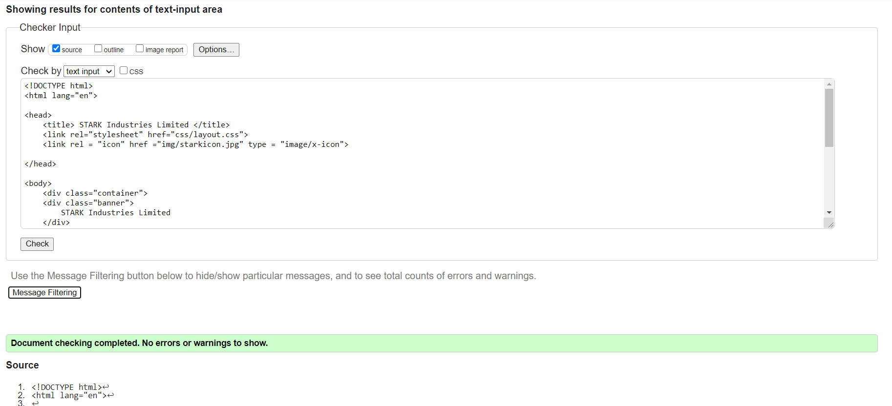
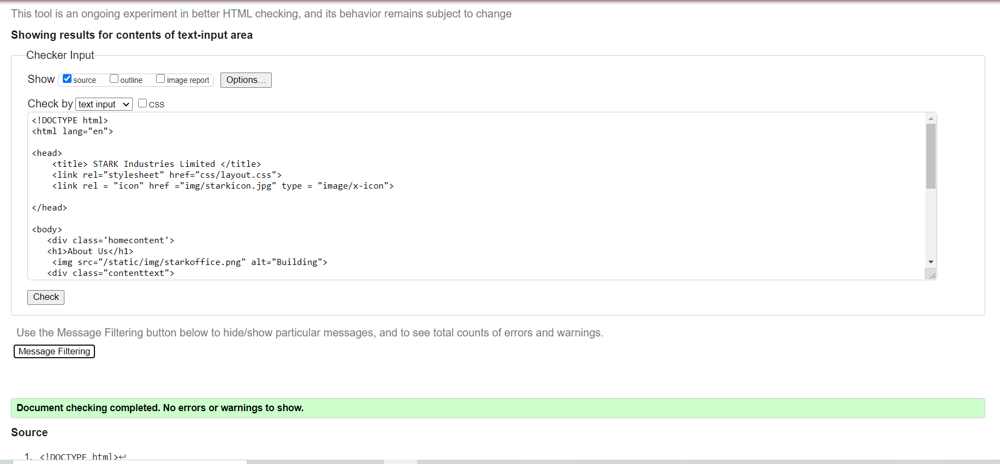
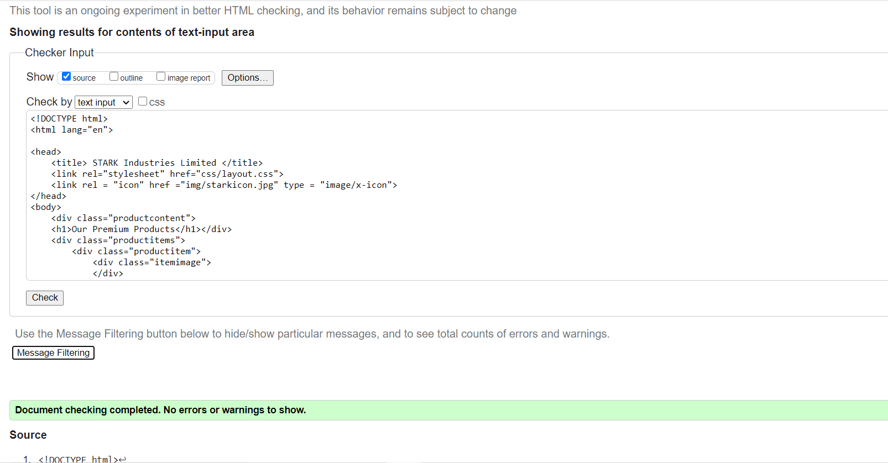
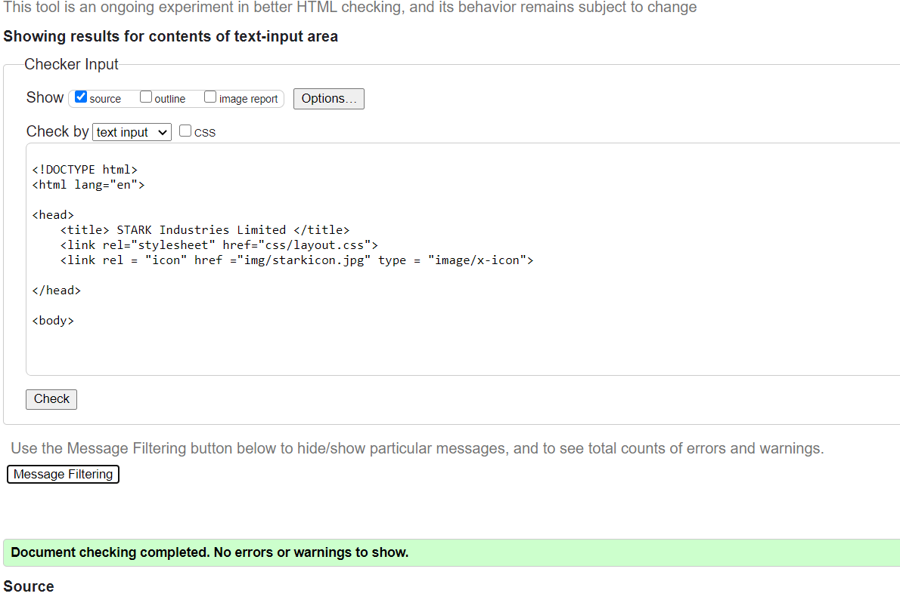

# Web Design for a Manufacturing Company
## AIM: 
To design a static website for a chip manufacturing company.

## DESIGN STEPS:
### Step 1: 
Requirement collection.
### Step 2:
Creating the layout using HTML and CSS.
### Step 3:
Updating the sample content.
### Step 4:
Choose the appropriate style and color scheme.
### Step 5:
Validate the layout in various browsers.
### Step 6:
Validate the HTML code.
### Step 6:
Publish the website in the given URL.

## PROGRAM:

### base.html
```

<!DOCTYPE html>
<html lang="en">

<head>
    <title> Prasanna Corp Limited </title>
    <link rel="stylesheet" href="">
    <link rel="icon" href="" type="image/x-icon">

</head>

<body>
    <div class="container">
        <div class="chip1">
            Prasanna Corp Limited
        </div>
        <div class="menu">
            <div class="menuitem"><a href="/home">Home</a></div>
            <div class="menuitem"><a href="/products">Products</a></div>
            <div class="menuitem"><a href="/people">People</a></div>
            <div class="menuitem"><a href="/contactus">Contact Us</a></div>
        </div>
        <div class="content">
            
            
        </div>
        <div class="footer">
            Copyright © 2021 PRAS Private Limited, Developed by Prasanna
        </div>
    </div>
</body>

</html>

```

### home.html
```



    <div class="homecontent">    
    <h1>About Us</h1>
    
    <div class="contenttext">
    Prasanna Corp Pvt Ltd, provides a broad range of semiconductor and infrastructure software applications that serve the data center, networking, software, broadband, wireless, and storage and industrial markets. Common applications for its products include: data center networking, home connectivity, broadband access, telecommunications equipment, smartphones, base stations, data center servers and storage, factory automation, power generation and alternative energy systems, displays, and mainframe operations and management, and application software development. Some of Silicon's core technologies and products include:
    <ul>
        <li>Memory Chips</li>
        <li>SATA HDD</li>
        <li>SATA SSD </li>
        <li>Broadband Modems</li>
        <li>Wifi Devices</li>
        <li>Switching Devices</li>
        <li>Optical Sensors</li>
    </ul> 
    </div>
    </div>

```
### products.html
```



    <div class="productcontent">    
    <h1>Our Premium Products</h1>
    <div class="productitems">
        <div class="productitem"> 
            <div class="itemimage">
            
            </div>
            <div class="itemname">4GB DDRA4 laptop memory</div>
            <div class="itemprice">Price: Rs.2000.00 </div>
        </div>
        <div class="productitem"> 
            <div class="itemimage">
            
            </div>
            <div class="itemname">1TB Laptop HDD</div>
            <div class="itemprice">Price: Rs.5000.00 </div>
        </div>
        <div class="productitem"> 
            <div class="itemimage">
            
            </div>
            <div class="itemname">Graphic card</div>
            <div class="itemprice">Price: Rs.30000.00 </div>
        </div>
        <div class="productitem"> 
            <div class="itemimage">
            
            </div>
            <div class="itemname">mouse</div>
            <div class="itemprice">Price: Rs.2000.00 </div>
        </div>
        <div class="productitem"> 
            <div class="itemimage">
            
            </div>
            <div class="itemname">speaker</div>
            <div class="itemprice">Price: Rs.5000.00 </div>
        </div>
        <div class="productitem"> 
            <div class="itemimage">
            
            </div>
            <div class="itemname">ram rgb</div>
            <div class="itemprice">Price: Rs.4000.00 </div>
        </div>
        <div class="productitem"> 
            <div class="itemimage">
            
            </div>
            <div class="itemname">RGB Keyboard</div>
            <div class="itemprice">Price: Rs.2500.00 </div>
        </div>
        <div class="productitem"> 
            <div class="itemimage">
            
            </div>
            <div class="itemname">SATA SSD (samsung)</div>
            <div class="itemprice">Price: Rs.5000.00 </div>
        </div>
        <div class="productitem"> 
            <div class="itemimage">
            
            </div>
            <div class="itemname">Boom Headset</div>
            <div class="itemprice">Price: Rs.3000.00 </div>
        </div>
        <div class="productitem"> 
            <div class="itemimage">
            
            </div>
            <div class="itemname">pendrive 64gb</div>
            <div class="itemprice">Price: Rs.2000.00 </div>
        </div>
        <div class="productitem"> 
            <div class="itemimage">
            
            </div>
            <div class="itemname">iot-board</div>
            <div class="itemprice">Price: Rs.5500.00 </div>
        </div>
        <div class="productitem"> 
            <div class="itemimage">
            
            </div>
            <div class="itemname">intel i9 9900k processor</div>
            <div class="itemprice">Price: Rs.36000.00 </div>
        </div>
    </div>
    </div>

```
### people.html
```



<div class="peoplecontent">
    <h1>Our Crew</h1>
    <div class="crewmembers">
        <div class="crewmember">
            <div class="memberimage">
                
            </div>
            <div class="membername">PRASANNAKUMAR</div>
            <div class="designation">C.E.O PRAS CORP</div>
        </div>
        <div class="crewmember">
            <div class="memberimage">
                
            </div>
            <div class="membername">SHOHEEL</div>
            <div class="designation">FRONTEND DEV</div>
        </div>
        <div class="crewmember">
            <div class="memberimage">
                
            </div>
            <div class="membername">VARMA</div>
            <div class="designation">TECHNICAL TEAM</div>
        </div>
        <div class="crewmember">
            <div class="memberimage">
                
            </div>
            <div class="membername">AADHI</div>
            <div class="designation"> R & D HEAD </div>
        </div>
        <div class="crewmember">
            <div class="memberimage">
                
            </div>
            <div class="membername">PRASHEETHA</div>
            <div class="designation"> DESIGN TEAM </div>
        </div>
        <div class="crewmember">
            <div class="memberimage">
                
            </div>
            <div class="membername">VINCENT</div>
            <div class="designation"> MARKETING HEAD </div>
        </div></div>
    </div>
    
```
### contactus.html
```



<h1>contactus:</h1>
<h2>emailid:prasannakumar10418@gmail.com</h2>
<h3>phone no:8667387776</h3>

```
## OUTPUT:






## CODE VALIDATION REPORT:






## RESULT:
Thus a website is designed for the chip manufacturing company and is hosted in the URL http://prasanna.student.saveetha.in:8000/. HTML code is validated.